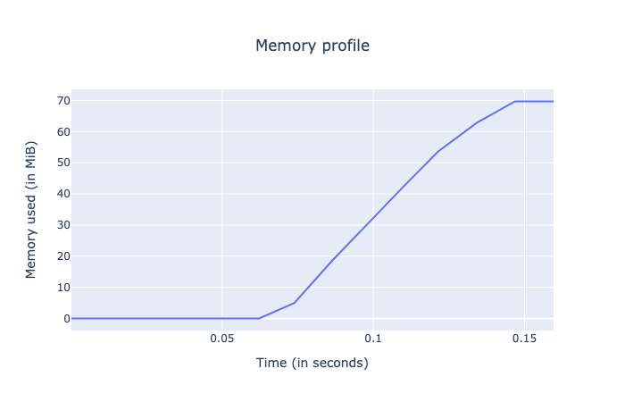
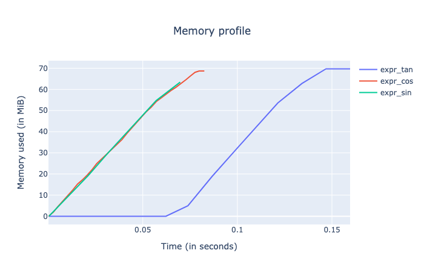
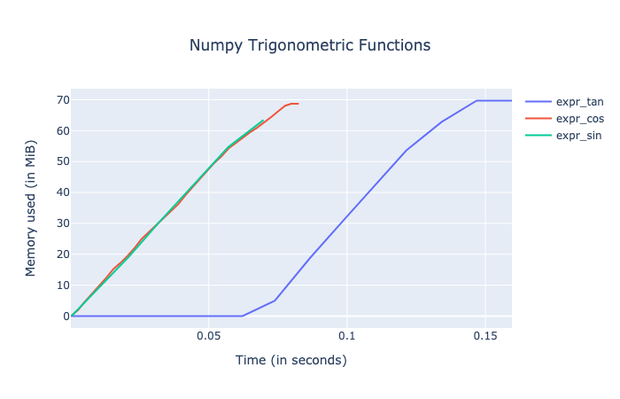

Tutorial
========

To start using the ``memprofiler`` extension in a Jupyter notebook,
simply run:

.. code:: ipython2

    %load_ext memprofiler

In this tutorial we will go through all the options of the memprofiler
extension while working with numpy arrays. So let’s get started!

.. code:: ipython2

    import numpy as np

.. code:: ipython2

    shape = (3000, 3000)
    a = np.linspace(0, 1, np.prod(shape)).reshape(shape)

Start sampling memory
---------------------

.. code:: ipython2

    %%mprof_run expr_sin
    
    _ = np.sin(a)

.. parsed-literal::

    Memory profiler: Used 68.6953 MiB (peak of 63.4258 MiB) in 0.0779 s

.. code:: ipython2

    %%mprof_run -i 0.002 expr_cos
    
    _ = np.cos(a)

.. parsed-literal::

    Memory profiler: Used 68.6680 MiB (peak of 68.6680 MiB) in 0.0842 s

.. code:: ipython2

    %%mprof_run --plot expr_tan
    
    _ = np.sin(a) / np.cos(a)

.. parsed-literal::

    Memory profiler: Used 69.7109 MiB (peak of 69.7070 MiB) in 0.1700 s

Plot multiple memory profiles at once
-------------------------------------

.. code:: ipython2

    %mprof_plot expr_sin expr_cos expr_tan

.. code:: ipython2

    %mprof_plot expr.*

.. code:: ipython2

    %mprof_plot --title "Numpy Trigonometric Functions" expr.*

